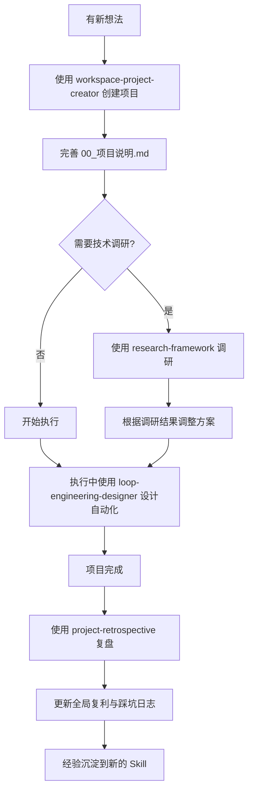

# Workspace Skills 总览

本目录封装了 `D:\Workspace` 工作区常用的标准化工作流，让 AI 助手能稳定、高质量地执行重复性任务。

## 📦 已封装的 Skills

| Skill 名称 | 描述 | 来源文档 | 推荐使用场景 |
|-----------|------|---------|-------------|
| **workspace-project-creator** | 按 SOP 自动创建标准化项目目录结构 | `00_全局控制台.md` `03_新项目创建SOP.md` | ⭐ 每次新建项目必须用 |
| **research-framework** | 标准化技术选型和项目调研分析框架 | 闲鱼多账号调研实践 | ⭐ 技术选型、GitHub 项目评估、可行性分析 |
| **loop-engineering-designer** | Loop Engineering 自动化流水线设计 | `04_ClaudeCode搭配Codex六种接线机制操作手册.md` `05_Cyrus說AI视频分析.md` | ⭐ 设计自动化工作流、过夜任务、AI 协作流程 |
| **project-retrospective** | 项目复盘与经验沉淀 | `01_全局复利与踩坑日志.md` | ⭐ 每个项目完成后必须执行 |
| **feishu-knowledge-sync** | 飞书知识库同步审计 | 已有 SKILL.md | 飞书/Notion 知识库更新前审计 |

---

## 🎯 使用方法

### 方式一：直接调用

当你需要执行对应任务时，直接告诉 Claude：

```
使用 workspace-project-creator skill 帮我创建一个新项目，名字是 XXX
```

```
使用 research-framework skill 调研一下 GitHub 上的 XX 项目
```

```
使用 loop-engineering-designer skill 帮我设计一个 XX 的自动化流程
```

```
使用 project-retrospective skill 对 Project_XXX 项目进行复盘
```

### 方式二：复制到工作区

你可以将这些 skill 文件复制到任意 Claude Code 工作区的 `.claude/skills/` 目录下，这样在该工作区打开时就可以直接使用。

---

## 📋 推荐工作流

### 新项目完整流程



---

## 🔄 同步到 codex-review-notes 仓库

### 推荐目录结构

```
codex-review-notes/
├── claude/                    # Claude Code 专用
│   ├── AGENTS.md             # D:\Workspace 规则的精简版
│   ├── skills/               # 这里放的 skill 文件
│   │   ├── workspace-project-creator.md
│   │   ├── research-framework.md
│   │   ├── loop-engineering-designer.md
│   │   ├── project-retrospective.md
│   │   └── feishu-knowledge-sync.md
│   └── README.md             # 使用说明
├── codex/                    # Codex 专用（后续补充）
│   ├── rules/
│   └── prompts/
├── global/                   # 通用沉淀
│   ├── 00_全局控制台.md
│   ├── 01_全局复利与踩坑日志.md
│   ├── 02_工作区提示词.md
│   ├── 03_新项目创建SOP.md
│   └── 04_ClaudeCode搭配Codex六种接线机制操作手册.md
└── README.md                 # 仓库总览
```

### 公司电脑使用

1. 克隆 `codex-review-notes` 仓库到本地
2. 将 `claude/skills/` 下的文件复制到工作区 `.claude/skills/`
3. 将 `claude/AGENTS.md` 复制到你的 `D:\Workspace`

### 家里电脑使用

1. 直接在 codex-review-notes 仓库中打开
2. 或者同样复制到对应工作区

---

## 💡 Skill 编写规范

### 头部 Frontmatter

每个 skill 文件开头必须有：

```yaml
---
name: skill-name-kebab-case
description: 一句话描述这个 skill 的用途，说明什么时候用
---
```

### 正文结构建议

```markdown
# Skill 名称

简短说明这个 Skill 是做什么的

## 何时使用

明确列出触发场景和不要使用的场景

## 核心规则

> 最重要的原则，用引用块突出

## 标准模板 / 流程

提供可以直接复制使用的模板

## 输出要求 / 检查清单

- [ ] 必须包含的内容1
- [ ] 必须包含的内容2

## 注意事项

提醒边界条件、风险、常见坑
```

---

## 📈 后续可以补充的 Skills

| 候选 Skill | 用途 | 优先级 |
|-----------|------|-------|
| **git-worktree-manager** | Git Worktree 创建、切换、清理 | 高 |
| **dual-model-review** | 双模型互审流程 | 高 |
| **feishu-bot-sender** | 飞书 Bot 消息推送模板 | 中 |
| **bug-report-template** | 标准化 Bug 报告模板 | 中 |
| **code-review-checklist** | 代码审查检查清单 | 中 |

---

## 📝 更新记录

| 日期 | 更新内容 |
|------|---------|
| 2026-06-29 | 初始版本，创建 4 个核心 Skills + 总览文档 |
